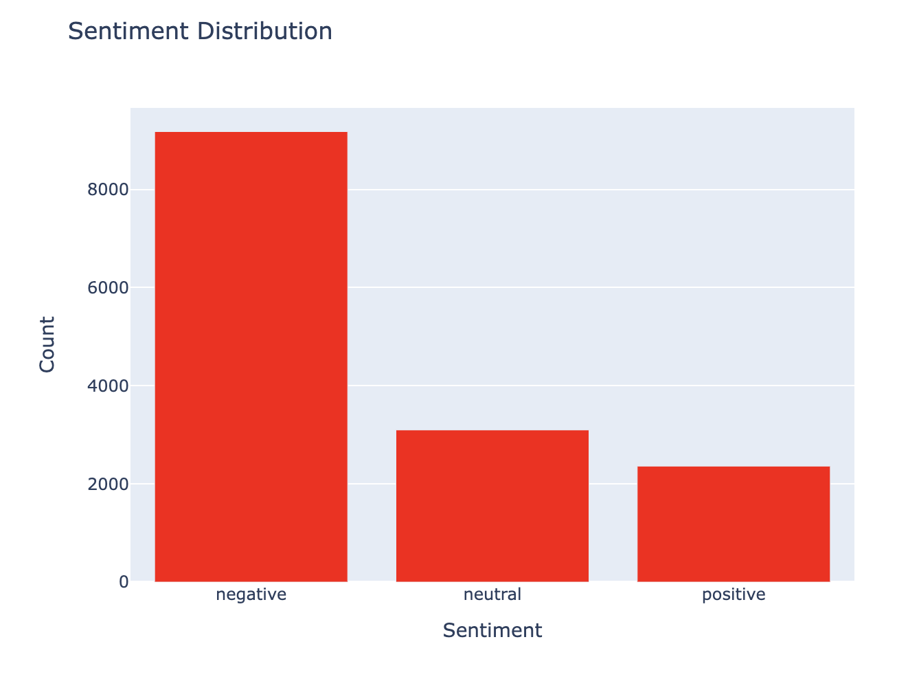
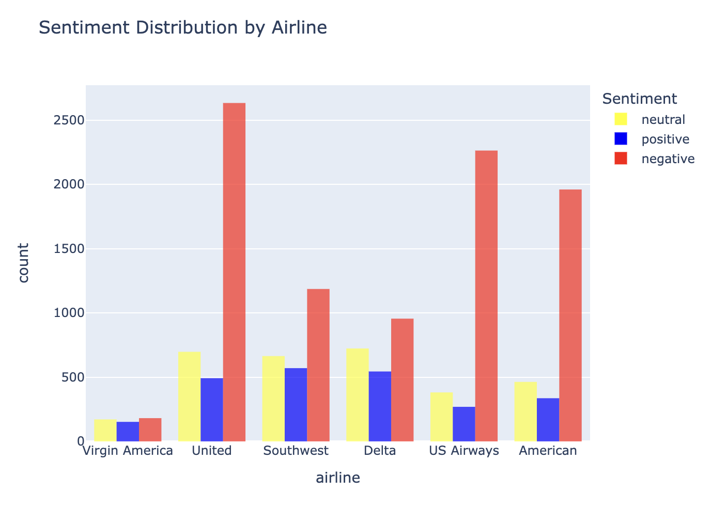
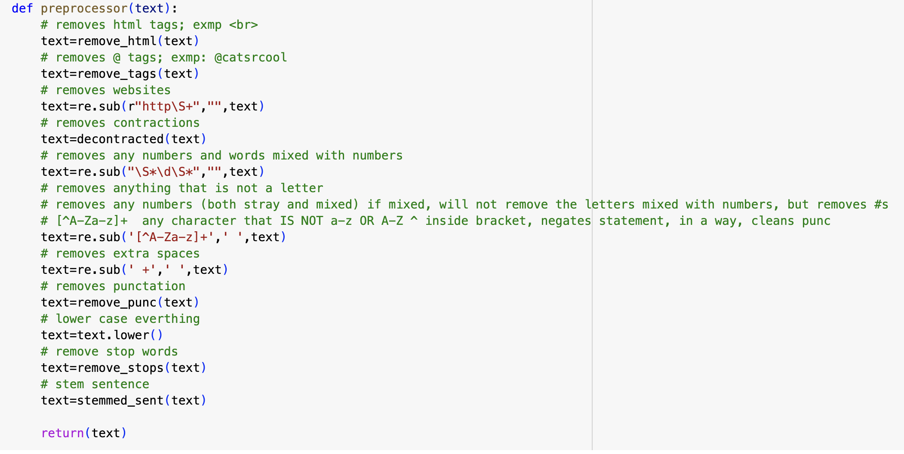
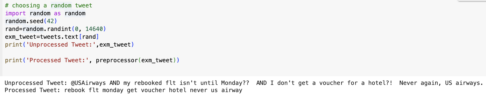
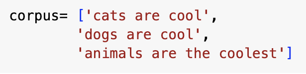
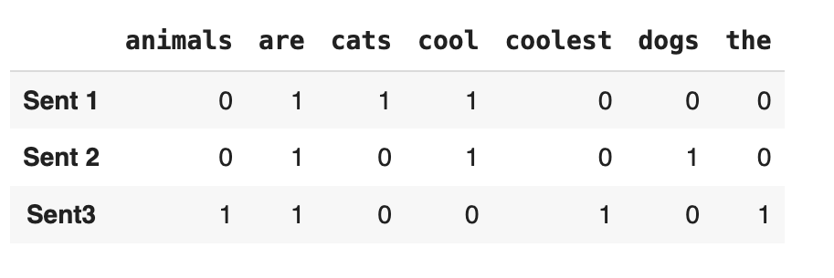
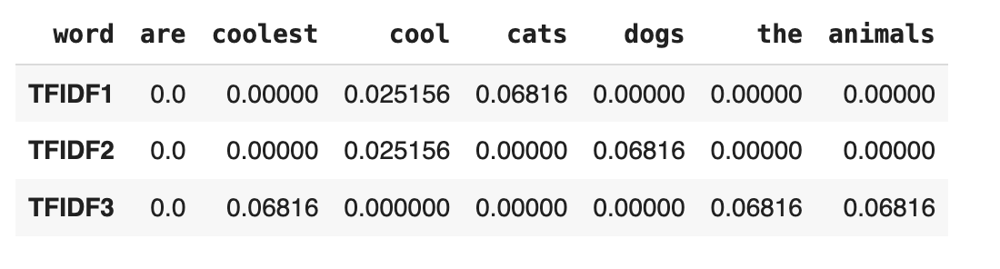
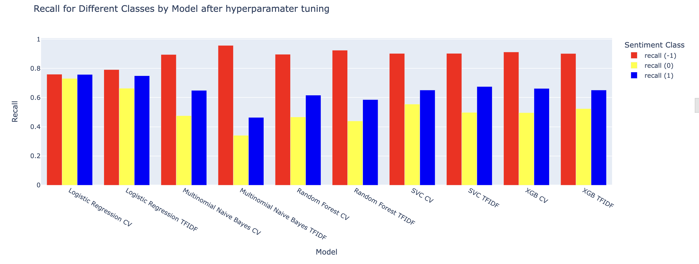
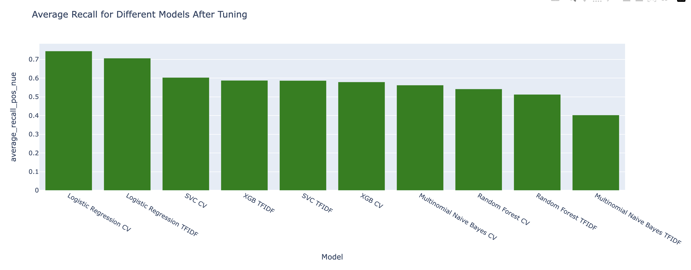

# USAirlinesSentimentAnalysis

Access the full notebook [here](https://colab.research.google.com/drive/1OGGfLQ9Ur6fyCHWXKFHErDpGFFXi0vXX#scrollTo=5d3f0558).

## Table of Contents:
- [Project Objectives](#project-objective)
- [Project Outcomes](#project-outcomes)
- [Understanding the Data](#understanding-the-data)
- [Text Preprocessing](#text-preprocessing)
- [Text Vectorization](#text-vectorization)
- [Evaluation Metrics](#evaluation-metrics)
- [Modeling with Non NN Models](#modeling-with-non-nn-models)

## Project Objectives: 
The objectives of this project are to:
- Develop a model that accurately classifies tweets regarding 6 U.S. Airlines into positive, negative, and neutral classes
- Discern which text vectorization/ word embedding technique results in the best performance for each classifier

## Project Outcomes 
- Developed a logistic regression classifier using bag of words text vectorization that resulted in an average minority class recall of 73% and overall accuracy of 77%
- Developed a convolutional neural network using pre-trained GloVe word embeddings that resulted in an average minority recall of 68.3%
- Developed an LSTM neural network using pre-trained GloVe word embeddings that resulted in an average minority recall of 67.5%

## Understanding the Data

- This data was taken from [Kaggle’s Twitter US Airline Sentiment](https://www.kaggle.com/datasets/crowdflower/twitter-airline-sentiment) dataset. 
- The dataset consists of 14,640 Twitter reviews of 6 various airlines. Each of the reviews is labeled as positive, negative, or neutral.

  

As we can see there are far more instances of negative tweets than of positive and neutral tweets. We expect our classifier to best be able to detect negative tweets because it has the most instances of that class to learn from. 

  

Among all airlines, the distribution of tweets across the classes is imbalanced. A majority of the reviews are negative. 

## Text Preprocessing 
 What is the purpose of text preprocessing?
- Feeding in cleaner data should yield better results in our models
- We can think of this as "normalizing" our text data
- Note that different models may perform better with/ without certain preprocessing steps
- For example, neural networks often perform better when words are not stemmed, as neural networks can learn complex patterns directly from raw text
- However, since we will begin with non-neural network machine learning models, we will thoroughly preprocess the text before inputting it into our model

  

Our preprocessor function cleans HTML tags, removes handles and URLs, strips punctuation, removes stop words, and stems words. 

  

An example of how our preprocessor function works when applied to a tweet. We can think of this step as making the text cleaner before vectorization.

## Text Vectorization 

Many models cannot handle text data as it is. Therefore we must convert the words into vectors of numbers that the model can interpret. There are several ways we can do this. For non NN models, we will use Bag of Words and TFIDF Vectorization. Later, for the NNs, we will discuss alternative word vectorization options.

**Bag of Words Vectorization**
- Each unique word is represented as a feature, and each tweet is represented as a row
- We put a 1 if the word is present in the tweet, and a 0 if the word is not present (one-hot encoding for text)
- Let's take a simple corpus with three sentences that we would like to vectorize:

  

We can use the count vectorizer function from sklearn to produce a one-hot encoded data frame with the rows as sentences in the corpus and the columns as the unique words in the corpus.

  

Now each tweet is a vector of 0s and 1s. Now we can feed these vectors into our models. 

**TFIDF Vectorization**

- Term frequency-inverse document frequency
- The basic idea: the more times a given term appears in a document (a particular sentence), the more important the word is to understand the document
- At the same time, terms that appear in almost every document are likely not important in understanding a specific document
- TF-IDF factors in both of these concerns

Since this involves a slightly more complex calculation, I will not be going into detail about it here. However, if you are interested in learning more about TFIDF, click [here](https://colab.research.google.com/drive/1OGGfLQ9Ur6fyCHWXKFHErDpGFFXi0vXX#scrollTo=4c1665d4). 

  

This is how we would represent each sentence in the corpus using TFIDF scores. As we can see, words that are important to a specific document have a higher score: example "cats" for document 1, "dogs" for document 2, and "coolest" for document 3. Words that appear in all documents like "are" have the lowest scores.

## Evaluation Metrics
We evaluate the performance of our classifiers using accuracy, precision, and recall. Since our dataset is dominated by negative tweets, our model will likely have the best recall in the negative class. **However, our most important metric is the recall in the minority classes- neutral and positive classes.** We want a model that is best able to recognize these tweets even with a limited number of instances to learn from. 

## Modeling with Non NN Models
For our non neural networks, we use the following models: 

**Multinomial Logistic Regression**

  
 More info 

- Multinomial logistic regression uses softmax coding, an extension of the logistic function, to calculate the probability that a tweet falls into each sentiment class:

  

- The softmax coding function, where:
  - K= total number of classes (3) in our case
  - x= input features of a particular tweet (the BOW or TFIDF vector)
  - Pr(Y=k|X=x): the probability that a tweet falls into a class k given the tweet’s input features
  - bk0,bk1,....: coefficients associated with the kth class
    - The coefficients for each class are found by maximizing the maximum likelihood function
- We calculate:
  - Pr(Y = positive | X = input features of a tweet)
  - Pr(Y = neutral | X = input features of a tweet )
  - Pr(Y = negative | X = input features of a tweet)
- The three probabilities should sum to 1 (probability distribution over the sentiment classes for a given tweet)
-  We assign the tweet to the class which has the highest probability
- Image source:
James, Gareth, et al. An Introduction to Statistical Learning: With Applications in R. Springer, 2021. pg 141, 4.13

 **Multinomial Naive Bayes**

  
 More info 

- Multinomial naive bayes use Bayes theorem to calculate the probabilities that a tweet falls into each class. It then assigns the tweet to the class with the highest probability.

  

- From Bayes theorem, where:
  - Pr (Y=k | X=x): probability that the tweets falls into a certain class k given the input features
  - πk: prior probability of a tweet falling into class k
  - f_k(x): Pr(X | Y=k): The likelihood of observing feature vector x given class k
- **In MNB, we make the assumption that within a certain class, the p predictors are independent (the words within a certain class are independent)**
- This makes calculating f_k(x) much easier. Instead of computing the joint probability of all the words in a tweet given a class, we take the product of the individual probabilities of observing a word given the class:
  - f_k(x)= Pr ( word 1 | class k ) * Pr ( word 2 | class k ) *  Pr ( word 3 | class k )
    - We calculate this value separately for all classes
- We substitute these values into the Bayes theorem formula, calculating
  - Pr ( Y = negative | X= tweet)
  - Pr ( Y= neutral | X= tweet)
  - Pr ( Y= positive | X = tweet)
- We assign the tweet to the class with the highest probability

- Image source:
James, Gareth, et al. An Introduction to Statistical Learning: With Applications in R. Springer, 2021. pg 142, 4.15

 **Support Vector Classifier**

  
 More info 

- Support Vector Classifier works by transforming vectorized tweets into points in a higher-dimensional space
- SVC aims to find a decision boundary in this space that separates the vectorized tweets into their respective sentiment classes
- The SVC decision boundary ( a hyperplane) maximumes the margin, or the distance between the decision boundary and the support vectors
- Support vectors are the points closest to the decision boundary that play an important role in deciding where the decision boundary lies
- When making new predictions, we transform the vectorized tweet into the high dimensional space and make the classification based on where the point lies relative to the hyperplane

 **Random Forest Classifier**

  
 More info 

- The Random Forest Classifier works by combining the predictions of multiple decision trees to make a final prediction
- Each decision tree is built from bootstrapped samples (random sampling with replacement of the tweets from the original data set) using a random subset of features (words)

  

- Exmp: suppose this decision tree is created from one bootstrapped sample of our data and a handful of random features ("okay", "happy", "angry")
- Each tree makes a prediction on where the observation goes
    - Suppose the observation is “It was okay”
    - We simply fall down the decision tree for this bootstrapped sample and land on Neutral
- We do this for all the decision trees
- “Vote” on which class our tweet falls in by choosing the class that most trees voted on
- This example is an extremely simplified version using bag of words vectorization.
- In the real model, the tweets have already been vectorized, and there are many more splitting nodes. This example still provides decent intuition.

 **XGB Classifier**

  
 More info 

- XGBoost classification is another type of ensemble, tree-based model that combines multiple decision trees to create a stronger classifier
- XGBoost makes an initial prediction for each tweet, and then builds decision trees iteratively, prioritizing correcting prior misclassification
- The idea is that each iterative tree should have a lower misclassification rate.
- XGBoost combines predictions from  all trees to make a final prediction on the sentiment of a tweet.

- After evaluating the model’s performance using default parameters, we begin hyperparameter tuning. 
- We train each of the tuned models and compare the metrics. 

  

- As expected, all classifiers have the highest recall in the negative class. Some classifiers like MNB with CV have twice the recall in the negative class compared to the neutral and positive classes. Other classifiers like logistic regression using CV have a more even distribution.

- For a more definite metric, we find the average recall in the positive and neutral classes. 

  

We will evaluate the models based on their average recall in the minority classes, choosing the version of each model (CV or TFIDF) that performed best after hyperparameter tuning.

1) Logistic Regression (CV) 74%
2) Support Vector Classifier (CV) (60%) 
3) XGB (TFIDF) (59%) 
4) MNB (CV) (56%) 
5) RF (CV) (54%) 

It is important to note that only Logistic Regression performed significantly better than the other models (15% increase from the next-best model). All the other models performed similarly, with a maximum difference between the models being 6% (between SVC and RF).

  
 Why did LR outperform all other models? 

- Soft Decision boundaries to identify minority classes:
  - LR uses soft decision boundaries to separate classes. What does this mean? Instead of making a strict decision of where a tweet belongs, LR computes a probability score for the tweet belonging in each of the classes. It then selected the class with the highest probability.
  - This allows the model to express uncertainty and acknowledge that some tweets have characteristics of multiple classes.
  - This can be advantageous because it reduces the bias towards the majority class. Instead of favoring the majority class due to class imbalance, the model will assign probabilities to all the classes, making it better equipped to handle complex relationships in the imbalanced data. This can lead to higher recall in minority classes.
- Potential Linear Separability:
  - In some instances, sentiment classes can be separated using linear decision boundaries, which logistic regression automatically assumes. Given the high recall in the minority classes, the sentiment classes may be linearly separable.

To learn more about model performance for the other models, click [here](https://colab.research.google.com/drive/1OGGfLQ9Ur6fyCHWXKFHErDpGFFXi0vXX#scrollTo=un5UTXf_XQ2w). 

To learn why CV outperformed TFIDF for most models, click [here](https://colab.research.google.com/drive/1OGGfLQ9Ur6fyCHWXKFHErDpGFFXi0vXX#scrollTo=DvQ0wcoTW7Et). 

**README in progress**

